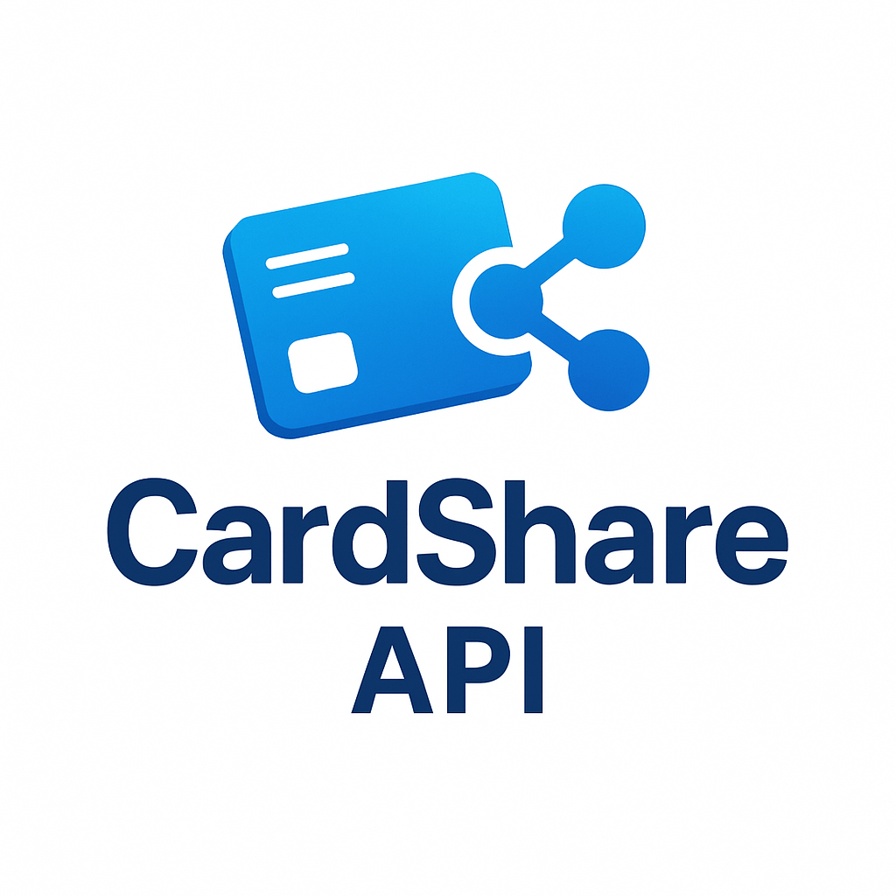

<p align="center">
  
</p>

# 🃏 CardShare API

A RESTful API for creating, organizing, and sharing custom cards — each with a title, description, and optional image. Designed for flexible information sharing and discovery, CardShare enables users to publish, manage, and interact with cards using **Node.js**, **Express**, and **MongoDB**, following the **MVC architecture**.

---

## 🚦 Project Status

This project is under active development.  
See [`to-do.md`](./to-do.md) for the full roadmap.

### ✅ Completed (MVP)

- User registration & login (JWT, password hashing, email verification)
- Card CRUD (create, read, update, delete)
- Card visibility (public/private/unlisted)
- Likes & favorites
- Pagination for cards
- MVC architecture
- Input validation & error handling

### 🟡 In Progress / Planned

- Full-text search & filters
- Comment system
- Share card functionality
- Activity feed
- Notification system
- Admin features

---

## 🚀 Project Overview

**Goal:**  
Develop a robust backend service to handle card-related data and user authentication, complete with CRUD operations, validation, testing, and deployment.

**Tech Stack:**

- **Node.js** – JavaScript runtime
- **Express.js** – Web framework
- **MongoDB** – Data persistence
- **Mongoose** – ODM for MongoDB
- **JWT** – JSON Web Token for authentication

---

## 🧱 Architecture

The project follows the **MVC (Model-View-Controller)** pattern:

```
├── models/
├── controllers/
├── routes/
├── middlewares/
├── services/
└── tests/
```

---

## 🃏 Card Schema

Here's the current structure for a `Card`:

```ts
Card {
  _id: ObjectId,
  name: string,         // Name of the card
  type: string,         // Type or category of the card
  description: string,  // Card effect or explanation
  imageUrl: string,     // Link to the card's image
  likes: number,        // Count of user likes
  visibility: 'private' | 'public' | 'unlisted',    // Visibility flag
  createdBy: ObjectId,  // User who created the card
  createdAt: Date,
  updatedAt: Date
}
```

---

## 🔐 Authentication & User Management

- JWT-based authentication
- Protected routes for:
  - Creating cards
  - Updating cards
  - Deleting cards
- Public routes for:
  - User registration (`/register`)
  - User login (`/login`)
  - Browsing public cards (`/cards?public=true`)

---

## 🔄 API Endpoints

| Method | Endpoint     | Description                         | Auth Required |
| ------ | ------------ | ----------------------------------- | ------------- |
| POST   | `/register`  | Register a new user                 | ❌            |
| POST   | `/login`     | Authenticate user                   | ❌            |
| POST   | `/cards`     | Create a new card                   | ✅            |
| GET    | `/cards`     | Retrieve all cards (public/private) | ❌ / ✅       |
| GET    | `/cards/:id` | Get card by ID                      | ❌ / ✅       |
| PUT    | `/cards/:id` | Update card by ID                   | ✅            |
| DELETE | `/cards/:id` | Delete card by ID                   | ✅            |

---

## ✅ Features

- ✅ MVC Architecture
- ✅ Card CRUD operations
- ✅ JWT-based auth
- ✅ Input validation
- ✅ Centralized error handling
- ✅ Public/Private card visibility
- ✅ Likes support

See [`to-do.md`](./to-do.md) for planned enhancements.

---

## 📦 Deployment

Deploy this API on services like:

- [Render](https://render.com)
- [Vercel](https://vercel.com)
- [Heroku](https://www.heroku.com)

Make sure to configure environment variables properly (e.g., JWT_SECRET, DB_URI).

---

## 📄 License

This project is licensed under the [MIT License](LICENSE).
